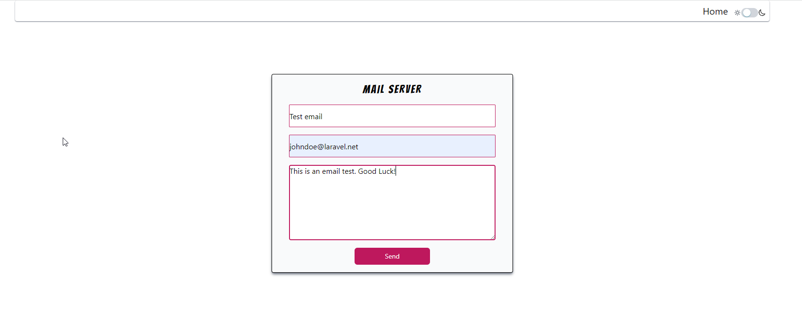
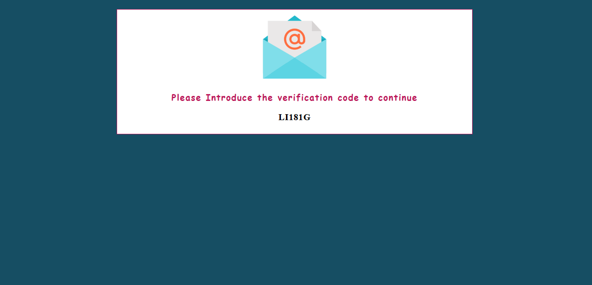

# Mail Server Laravel 9


### A simple mail server with the unit test and the smtp mail service active. This app allow you send an email to the creator of this app. Are you lucky ??
Send a email and try!!
-------------------

-------------------
# Requirements

+ php 8.1

+ Laravel 9

+ Nodejs (16 or Higher)

+ Mysql

+ Gmail account with access app code
-----------
# Installation
+ Clone the github repository
```
git clone https://github.com/userlg/Mail-Server-Laravel-9
```
+ Create the .env file and use your credentials. The following command only applies to linux
```
touch .env
```
+ Next step install all dependecies
```
composer install
```
```
npm install 
```
+ Do the migrations
```
php artisan migrate
```
+ Then only left run the project
```
php artisan serve
```
```
npm run dev
```
+ Generate the assets Builds
```
npm run build
```
+ Turn on the queue. This project works in the background with jobs and queue to improve the user experience
```
php artisan queue:work
```
+ Note: This project was tested on Windows 10.
-----------
# Screenshots
+ General cheme of the mail server


+ Project dark mode implement with tailwind




+ Security scan of mailtrap

+ Mailtrap spam report results


+ Finally the email recieved after the verification code process

+ Checking the mailtrap inbox

## The test coverage 91% 

-----------
### Created by Userlg